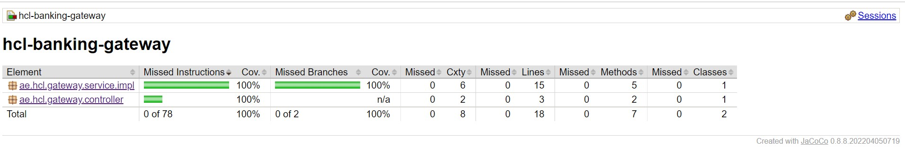
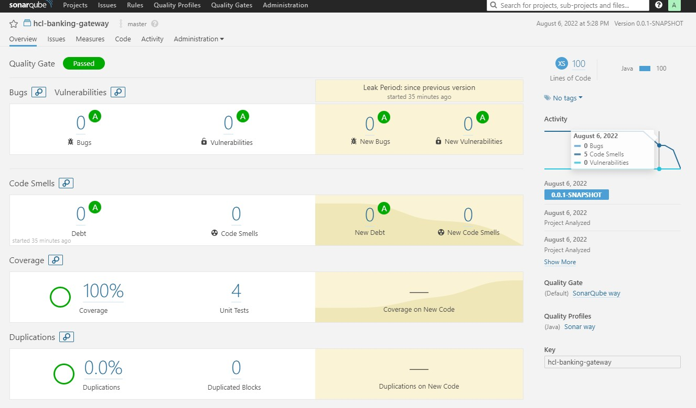

# HCL-Banking-Gateway

It's a simple Spring boot microservice for HCL-Banking-App. All the dependent microservices will
be accessible from this gateway.
Authorization and authentication will be handled through this API for that we'll generate JWT token.

#### Technologies:
- Java8
- Spring Boot
- Spring Data JPA
- Spring security
- Spring Web
- H2 DB
- Spring Doc open API
- Gradle project
- JUnit 5
- JaCoCo
- Docker

#### How to run
##### Run as a Docker
###### Build Docker image
* Run below command:
```
./gradlew bootBuildImage --imageName=hcl-banking-gateway
```
###### Run Docker image
```
docker run -p 8080:8080 hcl-banking-gateway
```
###### Run without Docker
```
./gradlew clean build bootRun
```
###### Code coverage report
* Make sure SonarQube server up and running or execute below command
```
docker run -d --name sonarqube -e SONAR_ES_BOOTSTRAP_CHECKS_DISABLE=true -p 9000:9000 sonarqube:6.7.5
```
* Please validate [SonarQube server up](http://localhost:9000/)
* Default username/password admin/admin
* Please run below command to check SonarQube report
```
./gradlew clean build sonarqube
```
Reports:

